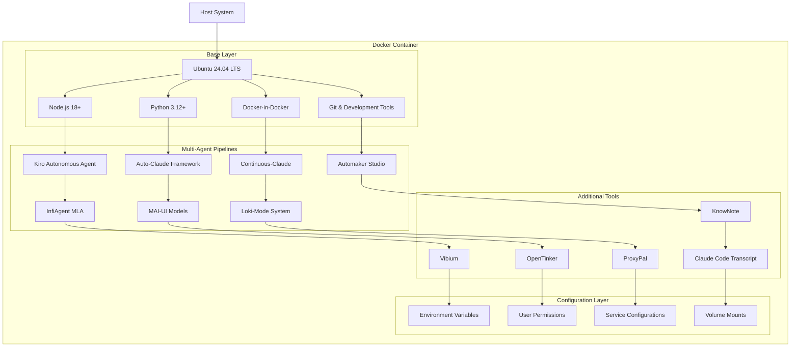

# Design Document: Docker Container Setup

## Overview

This design outlines the creation of a comprehensive Docker container image that includes the Base Container Image development environment and all multi-agent coding pipeline projects. The container will serve as a complete, ready-to-use development environment for autonomous agentic coding workflows.

The solution uses a multi-stage Docker build approach to efficiently install and configure all components while maintaining a reasonable image size. The container will be based on Ubuntu 24.04 LTS and include Node.js, Python, Docker-in-Docker capabilities, and all necessary development tools.

## Architecture

### Container Architecture



### Build Strategy

The Docker build will use a multi-stage approach:

1. **Base Stage**: Install system dependencies and runtime environments
2. **Tools Stage**: Clone and install all multi-agent pipeline projects
3. **Configuration Stage**: Set up environment variables, permissions, and configurations
4. **Final Stage**: Combine all components and create the final image

## Components and Interfaces

### Base Container Image Integration

The Base Container Image provides the foundational development environment. Based on research, this includes:

- **Operating System**: Ubuntu 24.04 LTS with standard development tools
- **Runtime Environments**: Node.js 18+, Python 3.12+, Git, curl, bash, apt
- **Development Tools**: Build essentials, text editors, debugging tools
- **Container Support**: Docker-in-Docker for nested containerization

### Multi-Agent Pipeline Components

#### Kiro Autonomous Agent
- **Installation**: Via official Kiro CLI or direct download
- **Dependencies**: Node.js 18+, Docker support
- **Configuration**: Sandbox environment with Dockerfile detection
- **Integration**: Environment configuration for autonomous operation

#### Auto-Claude Framework
- **Repository**: AndyMik90/Auto-Claude
- **Dependencies**: Python 3.12+, Claude API access
- **Installation**: Git clone and pip install requirements
- **Configuration**: Environment variables for API keys and settings

#### Continuous-Claude
- **Repository**: parcadei/Continuous-Claude-v2
- **Dependencies**: Node.js, Claude Code integration
- **Features**: Session continuity, MCP execution, context management
- **Installation**: npm install and configuration setup

#### Automaker Studio
- **Repository**: AutoMaker-Org/automaker
- **Dependencies**: Python, Docker, various AI model APIs
- **Installation**: Git clone and dependency installation
- **Configuration**: Workflow configuration and API setup

#### InfiAgent (MLA)
- **Repository**: ChenglinPoly/infiAgent
- **Dependencies**: Python 3.8+, configuration file support
- **Installation**: Git clone and pip install
- **Configuration**: Multi-level agent configuration files

#### MAI-UI Models
- **Repository**: Tongyi-MAI/MAI-UI
- **Dependencies**: Python, PyTorch, model files
- **Installation**: Git clone and model download
- **Configuration**: Model path configuration and GPU support

#### Loki-Mode System
- **Repository**: asklokesh/claudeskill-loki-mode
- **Dependencies**: Node.js, Claude integration
- **Installation**: npm install and configuration
- **Configuration**: Multi-agent startup system setup

### Additional Tools Integration

#### KnowNote
- **Repository**: MrSibe/KnowNote
- **Dependencies**: Python, local LLM support
- **Installation**: Git clone and pip install
- **Configuration**: Local-first setup without Docker dependency

#### Vibium
- **Repository**: VibiumDev/vibium
- **Dependencies**: Node.js, browser automation libraries
- **Installation**: npm install and browser setup
- **Configuration**: Browser automation configuration

#### OpenTinker
- **Repository**: open-tinker/OpenTinker
- **Dependencies**: Python, reinforcement learning libraries
- **Installation**: Git clone and pip install
- **Configuration**: RL service configuration

#### ProxyPal
- **Repository**: heyhuynhgiabuu/proxypal
- **Dependencies**: Desktop app framework, AI API access
- **Installation**: Binary download or build from source
- **Configuration**: AI subscription proxy setup

#### Claude Code Transcript
- **Repository**: simonw/claude-code-transcripts
- **Dependencies**: Python, Claude API access
- **Installation**: Git clone and pip install
- **Configuration**: Transcript generation setup

## Data Models

### Container Configuration Model

```typescript
interface ContainerConfig {
  baseImage: string;
  workingDirectory: string;
  user: {
    name: string;
    uid: number;
    gid: number;
  };
  environmentVariables: Record<string, string>;
  exposedPorts: number[];
  volumeMounts: VolumeMount[];
  services: Service[];
}

interface VolumeMount {
  hostPath: string;
  containerPath: string;
  readOnly: boolean;
}

interface Service {
  name: string;
  command: string;
  port?: number;
  healthCheck?: string;
}
```

### Pipeline Project Model

```typescript
interface PipelineProject {
  name: string;
  repository: string;
  branch: string;
  dependencies: Dependency[];
  installationSteps: InstallationStep[];
  configuration: Configuration;
  healthCheck: string;
}

interface Dependency {
  type: 'system' | 'npm' | 'pip' | 'binary';
  name: string;
  version?: string;
  optional: boolean;
}

interface InstallationStep {
  command: string;
  workingDirectory?: string;
  environment?: Record<string, string>;
}

interface Configuration {
  environmentVariables: Record<string, string>;
  configFiles: ConfigFile[];
  permissions: Permission[];
}
```

### Build Configuration Model

```typescript
interface BuildConfig {
  stages: BuildStage[];
  finalImage: {
    entrypoint: string[];
    cmd: string[];
    workdir: string;
    user: string;
  };
  optimization: {
    multiStage: boolean;
    layerCaching: boolean;
    minimizeSize: boolean;
  };
}

interface BuildStage {
  name: string;
  baseImage: string;
  steps: BuildStep[];
  artifacts: string[];
}
```

Now I need to use the prework tool to analyze the acceptance criteria before writing the correctness properties:

## Correctness Properties

*A property is a characteristic or behavior that should hold true across all valid executions of a system—essentially, a formal statement about what the system should do. Properties serve as the bridge between human-readable specifications and machine-verifiable correctness guarantees.*

### Property 1: Base Container Integration Completeness
*For any* Docker container built from our Dockerfile, all components from the Base Container Image should be present and functional in the final container.
**Validates: Requirements 1.1, 1.3**

### Property 2: Container Startup Readiness
*For any* container instance started from our image, all development services should be running and accessible within a reasonable startup time.
**Validates: Requirements 1.2, 6.2**

### Property 3: Pipeline Project Installation Completeness
*For any* multi-agent pipeline project listed in the requirements, the project should be installed with all dependencies satisfied and properly configured in the container.
**Validates: Requirements 2.1, 2.2, 2.3, 2.4, 2.5, 2.6, 2.7, 2.8**

### Property 4: Additional Tools Availability
*For any* additional tool (KnowNote, Vibium, OpenTinker, ProxyPal, claude-code-transcript), the tool should be installed and accessible with proper configurations and dependencies.
**Validates: Requirements 3.1, 3.2, 3.3, 3.4, 3.5, 3.6**

### Property 5: Development Environment Configuration
*For any* development operation performed in the container, the operation should succeed without permission errors, missing dependencies, or configuration issues.
**Validates: Requirements 4.1, 4.2, 4.3, 4.4**

### Property 6: Build Process Reliability
*For any* standard Docker environment, the Dockerfile should build successfully without errors and complete within reasonable time limits.
**Validates: Requirements 4.5, 6.1, 6.3, 6.5**

### Property 7: Container Size Optimization
*For any* built container image, the final size should be within reasonable limits while including all required components (target: under 8GB).
**Validates: Requirements 4.6**

### Property 8: Documentation Completeness
*For any* major component or pipeline project, documentation should exist that includes installation verification, usage examples, and basic troubleshooting guidance.
**Validates: Requirements 5.1, 5.2, 5.3, 5.4**

### Property 9: Runtime Compatibility
*For any* common container orchestration platform (Docker Compose, Kubernetes, Docker Swarm), the container should deploy and run successfully with volume mounting support.
**Validates: Requirements 6.4, 6.6**

## Error Handling

### Build-Time Error Handling

**Network Failures**: The Dockerfile will include retry mechanisms for network operations and fallback strategies for downloading dependencies. Critical downloads will be verified with checksums.

**Dependency Conflicts**: The build process will use virtual environments and containerized installations to isolate dependencies between different pipeline projects.

**Permission Issues**: The build will set appropriate file permissions and user configurations to prevent runtime permission errors.

**Resource Constraints**: The build will include cleanup steps to remove unnecessary files and optimize layer sizes.

### Runtime Error Handling

**Service Startup Failures**: The container will include health checks and startup scripts that verify all services are running correctly.

**Missing Dependencies**: Runtime checks will verify that all required dependencies are available before starting services.

**Configuration Errors**: The container will validate environment variables and configuration files on startup.

**Resource Exhaustion**: The container will include monitoring and alerting for resource usage issues.

### Recovery Mechanisms

**Graceful Degradation**: If optional services fail, the container will continue to operate with core functionality.

**Automatic Restart**: Critical services will be configured with restart policies to recover from transient failures.

**Logging and Diagnostics**: Comprehensive logging will be implemented to aid in troubleshooting and debugging.

## Testing Strategy

### Dual Testing Approach

The testing strategy combines unit tests for specific functionality verification and property-based tests for comprehensive validation across all inputs and configurations.

**Unit Tests**: Focus on specific examples, edge cases, and error conditions:
- Dockerfile syntax validation
- Individual component installation verification
- Configuration file validation
- Service startup verification
- Integration points between components

**Property-Based Tests**: Verify universal properties across all inputs:
- Container build success across different environments
- Service availability across different startup scenarios
- Dependency satisfaction across all pipeline projects
- Configuration correctness across all components
- Performance characteristics across different resource constraints

### Property-Based Testing Configuration

**Testing Framework**: Use pytest with Hypothesis for Python-based tests and Docker-based integration tests.

**Test Configuration**: Each property test will run a minimum of 100 iterations to ensure comprehensive coverage through randomization.

**Test Tagging**: Each property-based test will be tagged with the format:
**Feature: docker-container-setup, Property {number}: {property_text}**

### Test Categories

**Build Tests**:
- Dockerfile builds successfully on different Docker versions
- Build process completes within time limits
- Final image size is within acceptable bounds
- All components are properly installed

**Runtime Tests**:
- Container starts successfully in different environments
- All services are accessible and functional
- Volume mounting works correctly
- Environment variables are properly set

**Integration Tests**:
- Pipeline projects can be executed successfully
- Dependencies are satisfied for all components
- Configuration files are valid and accessible
- Network connectivity works as expected

**Performance Tests**:
- Build time is within acceptable limits
- Container startup time is reasonable
- Resource usage is optimized
- Image size is minimized while maintaining functionality

### Continuous Integration

The testing strategy will be integrated into a CI/CD pipeline that:
- Builds the container on multiple platforms
- Runs all property-based tests
- Validates performance characteristics
- Ensures compatibility with different orchestration platforms
- Generates comprehensive test reports and documentation